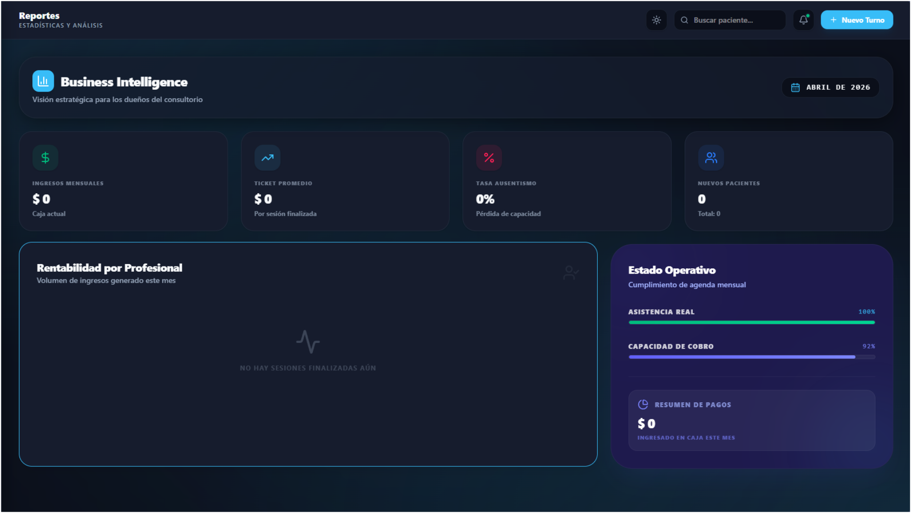
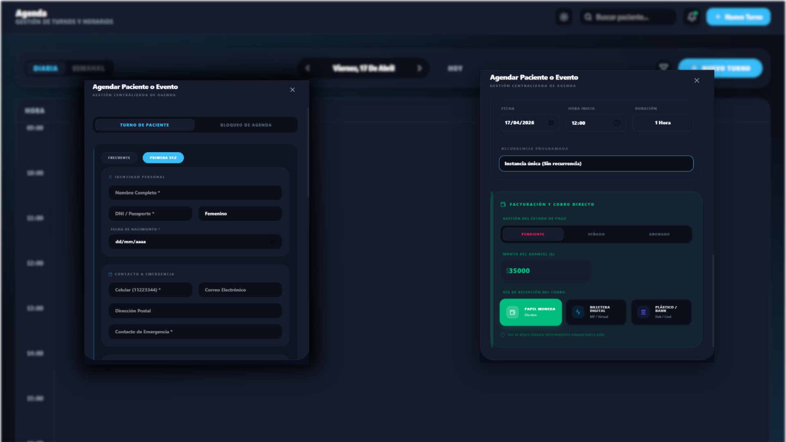

# 🏥 Integrar Salud | Sistema de Gestión Clínica

<p align="center">
  
  
  
  
</p>

**Integrar Salud** es una plataforma integral diseñada para la gestión eficiente de consultorios médicos y centros de salud mental. El sistema centraliza la agenda, la facturación y el seguimiento de pacientes en una interfaz moderna, rápida y segura.

---

## 🚀 Características Principales

| Módulo | Funcionalidades |
| :--- | :--- |
| 📅 **Agenda Inteligente** | Gestión de turnos con vistas diarias/semanales, bloqueos de agenda y control de asistencia en tiempo real. |
| 💰 **Facturación y Cobros** | Módulo de pagos integrado con soporte para señas, saldos pendientes y múltiples medios (Efectivo, Mercado Pago, Tarjeta). |
| 📂 **Historias Clínicas** | Seguimiento detallado de la evolución del paciente, registro de medicación y gestión de archivos adjuntos. |
| 📊 **Business Intelligence** | Dashboard de gestión financiera con reportes avanzados de ingresos, egresos y honorarios profesionales. |
| 🔐 **Seguridad & Roles** | Autenticación robusta y control de acceso basado en roles (Admin, Médico, Recepción). |

---

## 🛠️ Tecnologías y Stack

Este repositorio contiene el **Frontend** de la aplicación, utilizando herramientas de última generación:

* **Core**: [React 19](https://react.dev/) + [Vite](https://vitejs.dev/) para un desarrollo ultra rápido.
* **Estilos**: [Vanilla CSS](https://developer.mozilla.org/en-US/docs/Web/CSS) + [Tailwind CSS](https://tailwindcss.com/) para un diseño responsivo y moderno.
* **Estado**: [Zustand](https://github.com/pmndrs/zustand) para la gestión del estado global de forma ligera.
* **Iconos**: [Lucide React](https://lucide.dev/) para una interfaz intuitiva.
* **Gráficos**: [Recharts](https://recharts.org/) para la visualización de datos financieros.

---

## 📦 Instalación y Desarrollo

Para levantar el entorno de desarrollo localmente, sigue estas instrucciones:

1.  **Clonar el repositorio:**
    ```bash
    git clone https://github.com/Jmpyy/Integrar-salud
    ```

2.  **Instalar dependencias:**
    ```bash
    npm install
    ```

3.  **Configurar variables de entorno:**
    Crea un archivo `.env` basado en el ejemplo proporcionado:
    ```bash
    cp .env.example .env
    ```

4.  **Iniciar modo desarrollo:**
    ```bash
    npm run dev
    ```

---

## 📸 Capturas de Pantalla (Screenshots)

### 🖥️ Dashboard de Gestión
*Visualización general de métricas financieras e ingresos.*


### 📅 Agenda de Turnos
*Interfaz dinámica para la organización de citas médicas.*


---

<p align="center">
  Desarrollado por <b>Juampy</b>
</p>
